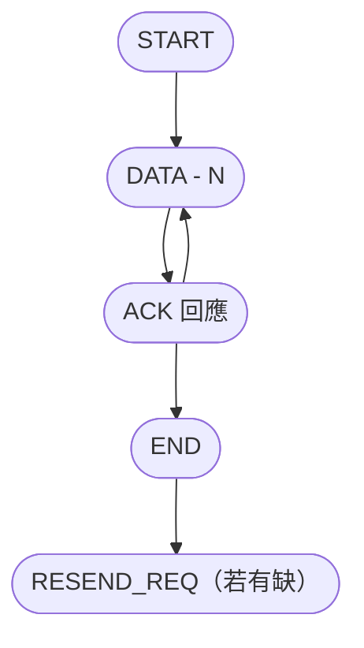

# 藍芽圖片資料交換通訊協定

此文件用以設計一套適用於透過藍芽SSP，用於圖片串流傳輸的傳輸協定設計


## 一、檔案傳輸協定

### 封包格式

```
| HEADER | TYPE | FILE ID | INDEX | LENGTH | DATA | CHECKSUM |
```

| **欄位**  | **長度** | **說明**                                                     |
| --------- | -------- | ------------------------------------------------------------ |
| HEADER    | 2 bytes  | 0xAA 0x55                                                    |
| TYPE      | 1 byte   | 封包類型（見下表）                                           |
| INDEX     | 2 bytes  | 封包序號（從 0 開始）                                        |
| LENGTH    | 2 bytes  | DATA 長度（最大 1024 或視實作限制）                          |
| DATA      | n bytes  | 真正圖片資料（raw binary / JPEG 等）                         |
| CHECK SUM | 2 bytes  | 將[HEADER, TYPE, INDEX, LENGTH, DATA] 資料每個bytes互加後最右側之2 bytes值 |

#### TYPE 封包類型定義

| **值** | **名稱**   | **用途說明**                           |
| ------ | ---------- | -------------------------------------- |
| 0x01   | START      | 開始封包，攜帶總圖檔大小與封包數       |
| 0x02   | DATA       | 資料封包，實際圖片資料分段             |
| 0x03   | END        | 結尾封包，表示資料傳送完畢             |
| 0x04   | ACK        | 回應封包，確認接收成功                 |
| 0x05   | RESEND_REQ | 要求補傳某幾段 INDEX（用 DATA 帶索引） |


## 二、圖片傳輸流程





### 傳送端傳輸流程（Sender，例如 Android)

1. 將圖片壓縮成 JPEG
2. 計算總大小、分段數量（如每包 512 bytes）
3. 發送 START
4. 依序發送每個 DATA 封包
5. 發送 END
6. ~~監聽是否有 RESEND_REQ，補傳指定 index~~

> [!TIP]
>
> 重新請求資料將大幅度延遲圖片傳輸效率，因此實作時當資料不完整，會放棄該張圖片


### 接收端流程（Receiver，例如 MCU)

1. 接收 START，準備緩衝區
2. 接收 DATA 封包並驗證 CRC
3. 若校驗失敗或缺包，記錄 INDEX
4. 收到 END 後比對是否完整
5. 回傳 RESEND_REQ 若有缺包
6. 資料完整後合併為圖檔


## 三、資料結構

### START 封包格式（TYPE = 0x01）

Client 通知 Server，開始傳送檔案資料


```
結構：| HEADER[2] | TYPE[1] | FILE ID[2] | INDEX[2] | LENGTH[2] | DATA[14] | CHECKSUM[2] |
範例：| 0xAA 0x55 | 0x01 | 0x0000 | 0x0008 | [DATA: 12 bytes] | CHECKSUM |
```

DATA 內容如下：

```
結構：|FILE LENGTH[4] | CHUNKS NUMBER[4] | FILE POSTFIX[4] |
```


**FILE LENGTH**: 要傳輸的資料長度有多少bytes

**CHUNKS NUMBER**: 資料切分成多少個 chunk數量。例如每512 bytes資料切成一個chuck，則有一個3000 bytes長度的資料會被切分爲 6個 chunk

**FILE ID** : 每個檔案有自己的整數ID，當檔案風包缺漏時，以FILE ID 和 INDEX 來找到缺漏的封包

**FILE POSTFIX**：檔案副檔名如jpg, png. 用以方便辨識檔案型別


### DATA 封包格式 (TYPE = 0x02)

Client 將檔案資料切分成數個chunks，依序使用DATA封包傳送每個chunk

```
結構：| HEADER[2] | TYPE[1] | FILE ID[2] | INDEX[2] | LENGTH[2] | DATA[14] | CHECKSUM[2] |
範例：| HEADER | 0x02 | 0x0000 | 0x0200 | [DATA: 512 bytes] | CHECKSUM |
```


### END 封包格式 (TYPE = 0x03)

Client 通知Server，完成所有資料傳送

```
結構：| HEADER[2] | TYPE[1] | FILE ID[2] | INDEX[2] | LENGTH[2] | DATA[14] | CHECKSUM[2] |
範例：| HEADER | 0x03 | 0x0000 | 0x0000 | [DATA: 0 bytes] | CHECKSUM |
```


### ~~ACK 封包（TYPE = 0x04）~~

Server 通知Client 已收到某個chunk

> [!TIP]
>
> 重新請求資料將大幅度延遲圖片傳輸效率，因此實作時當資料不完整，會放棄該張圖片


```
結構：| HEADER[2] | TYPE[1] | FILE ID[2] | INDEX[2] | LENGTH[2] | DATA[14] | CHECKSUM[2] |
範例：| HEADER | 0x04 | 0x0000 | 0x0002 | 0x00 0x02 | CHECKSUM | // ACK index 2
```


### RESEND（TYPE = 0x05）

Server 通知 Client 某個 Chunk 資料缺漏，請求重新傳送該chunk

> [!TIP]
>
> 重新請求資料將大幅度延遲圖片傳輸效率，因此實作時當資料不完整，會放棄該張圖片


```
結構：| HEADER[2] | TYPE[1] | FILE ID[2] | INDEX[2] | LENGTH[2] | DATA[14] | CHECKSUM[2] |
範例：| HEADER | 0x05 | 0x0000 | 0x0002 | 0x00 0x04 | CHECKSUM | //請求重送 index 2

```


## 四、Server端(車機)實作提示

### 廣播提供搜尋與靜默連線

ANW Connect App 提供兩種模式提供連線，

1. 開啟服務時同時將手機設為discoverable

    適用於車機(Client)首次連線該手機時，這時車機沒有該連線對象的藍牙MAC address，因此要先透過App將手機設為discoverable，時限為300秒，這時車機可以透過掃描來找到該手機做連線。

    當連線後，車機可以將該連線對象的藍牙MAC address儲存下來，並作為下次嘗試連線對象。

2. 開啟服務時，不將手機設為discoverable

    當ANW Connect App 開啟時，如果在[App設定>啟用導航圖片串流]是開啟，那就會自動開啟串流服務等待車機連線。這個時候並不會將手機設為藍芽discoverable，也就是車機此時會搜尋不到手機，但是可以用mac address來直接連線來連上服務。
